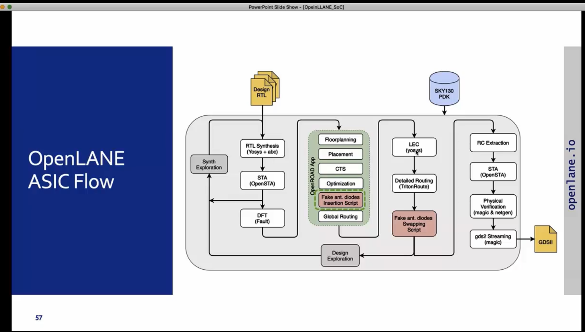

# Digital VLSI design & SoC planning - NASSCOM, VSD
## Day 1
- introduction to open source SoC design tools and the various parties involved
- introduction to Openlane flow
- tool installation
- exploring openlane tool directory
- running tool using interactive flow
- preping design
- running synthesis
- checking output files
- assignment : Flop ratio = 1613/14876 = 0.10842968539930088733530518956709 = 10.84%

```
docker
pwd
ls -ltr
flow.tcl -interactive 
package require openlane 0.9
prep -design picorv32a
run_synthesis

```





