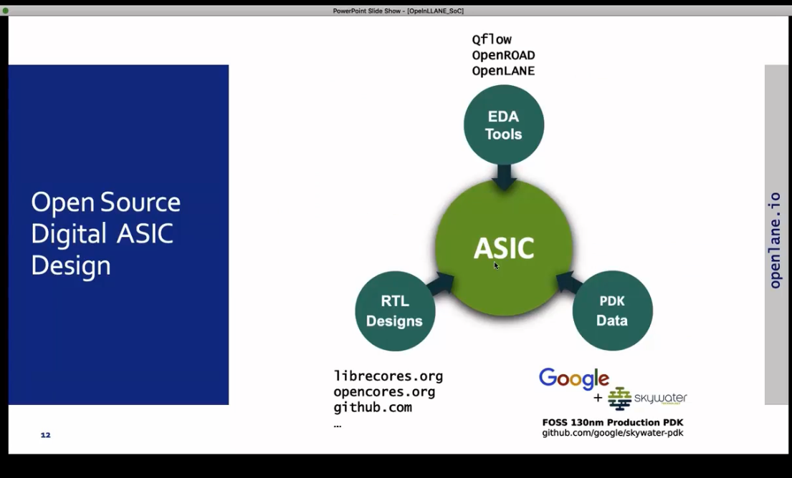
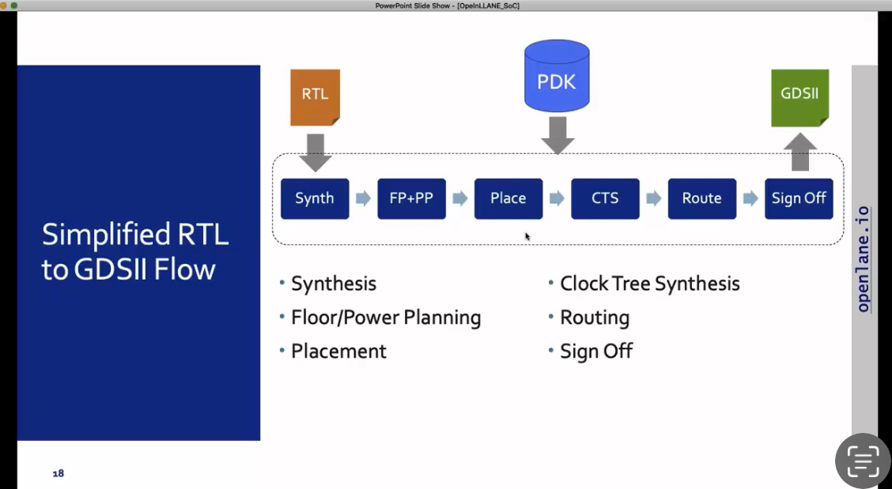

# Digital VLSI design & SoC planning - NASSCOM, VSD

## Day 1
- introduction to open source SoC design tools and the various parties involved
- introduction to Openlane flow
- tool installation
- exploring openlane tool directory
- running tool using interactive flow
- preping design
- running synthesis
- checking output files
- assignment : Flop ratio = 1613/14876 = 0.10842968539930088733530518956709 = 10.84%

```
docker
pwd
ls -ltr
flow.tcl -interactive 
package require openlane 0.9
prep -design picorv32a
run_synthesis

```


Fig: Open source EDA tools

Fig: Openlane ASIC flow

Fig: RTL to GDSII flow 

Fig: Openlane interactive flow

Fig: Exploring Openlane directory

Fig: Synthesis result

Fig: Synthesis resultant files exploration

## Day 2
### Floorplanning
- Define width and height of core and die
- Define locaation of preplaced cells
- Decoupling Capacitor
- Power planning
- Pin placement
- Logical cell placement blockage
- Die area = (660685/1000)(671405/1000) = 443,587.212425 sq um


```
run_floorplan
```
or
```
init_floorplan
place_io
tap_decap_or
```
To check floorplan layout
```
magic -T /home/vsduser/Desktop/work/tools/openlane_working_dir/pdks/sky130A/libs.tech/magic/sky130A.tech lef read ../../tmp/merged.lef def read picorv32a.floorplan.def &
```

Fig: Floorplan results

Fig: Floorplanning log file exploration

Fig: Floorplanning log file exploration

Fig: Floorplanning logs

Fig: Floorplanning layout

Fig: Showing decapacitors

Fig: preplaced cells
### Placement
- Bind netlist with physical cells
- optimize placement using wire length and capacitance
- Repeters to maintain signal integrity but loss of area
- capacitance leads to slew

```
run_placement
```
check output
```
~/Desktop/work/tools/openlane_working_dir/openlane/designs/picorv32a/runs/16-08_03-33/results/placement$ magic -T /home/vsduser/Desktop/work/tools/openlane_working_dir/pdks/sky130A/libs.tech/magic/sky130A.tech lef read ../../tmp/merged.lef def read picorv32a.placement.def &
```
optimization
```
set ::env(FP_IO_MODE) 2
run_floorplan
```


Fig: Placement result

Fig: Placed cells

### Library characterization and modelling

- Cell design flow

- Characterization flow
- - Read model file
  - read extracted spice netlist
  - define buffer behavior
  - read buffer subcircuit
  - read necessary power supply
  - attach stimulus to charcterization setup
  - give necessary output capacitance
  - give simulation command (.trans, .dc)
- input 1-8 to GUNa software (Fig below)
- - Timing & noise power characterization output


- Timing introduction
- - Timing threshold definitions
    
  - Timing characterization
  - - Propagation delay
      
    - Transition time
      


## Day 3
### Std cell design
- available at https://github.com/nickson-jose/vsdstdcelldesign
  - Not covered in detail in this course
  - Study spice deck for cell
  - study cell model files
  - Evaluate effect of size of pmos and nmos cells
    
    
    

- We Then learned the basics of the fabrication process
  - 16 mask CMOS process
      - Selecting a substrate
      - N well and P well formation
      - Creating active region for transistors (mask1)
      - Gate Formation
      - Light doped drain (LDD) formation
      - Source and drain formation
      - Forming contacts and local interconnects
      - Higher level metal formation


- custom cell
```
vsduser@vsdsquadron:~/Desktop/work/tools/openlane_working_dir/openlane$ git clone https://github.com/nickson-jose/vsdstdcelldesign.git

vsduser@vsdsquadron:~/Desktop/work/tools/openlane_working_dir/pdks/sky130A/libs.tech/magic$ cp sky130A.tech /home/vsduser/Desktop/work/tools/openlane_working_dir/openlane/vsdstdcelldesign

vsduser@vsdsquadron:~/Desktop/work/tools/openlane_working_dir/openlane/vsdstdcelldesign$ magic -T sky130.tech sky130_inv.mag 

vsduser@vsdsquadron:~/Desktop/work/tools/openlane_working_dir/openlane/vsdstdcelldesign$ magic -T sky130A.tech sky130_inv.mag 

ngspice sky130_inv.spice
```
### Extracting cell to use in design
- Extract the custom inverter cell using ext2spice
  - Extract cell
  - 

  - study cell layout using magic & check drc (lab)
  - 

  - run ngspice simulation


```
    To deal with spikes
    Close less
    Open spice file
    Change defined between output Y pin and gnd
    Change 0.02 farad to 0.2 farad
```


  - calculated
    - fall transition
    - 
    - 


```
x0 = 2.18e-09, y0 = 0.66

x0 = 2.121e-09, y0 = 2.63979

==> 0.059ns
```
  - - rise transition
    - 
    - 


```
x0 = 4.02002e-09, y0 = 0.659928

x0 = 4.08115e-09, y0 = 2.64128

==> 0.06113 ns
```
  - - fall delay
    - 

```
x1 = 2.15007e-09, y1 = 1.65
x0 = 2.18664e-09, y0 = 1.65

==> 0.03657 ns
```
  - - rise delay
    - 

```
x0 = 4.05002e-09, y0 = 1.64994

x0 = 4.05322e-09, y0 = 1.65012

==> 0.0032 ns
```
- Now we have characterised out inverter, we now create a LEF file which we use in our openlane for picorv32
```
vsduser@vsdsquadron:~/Desktop/work/tools/openlane_working_dir/openlane/vsdstdcelldesign/libs$ sky130_rohang.lef
```
 ### Lab introduction to magic tools option and DRC rules
```
wget http://opencircuitdesign.com/open_pdks/archive/drc_tests.tgz

tar xfz drc_tests.tgz
```
- Draw large area of m3 contact
  
```
cif see via2
```
  

- - Tech files has commands to tell magic how to draw contact cuts inside contact area


- Lab excersize fix ploy.9 error in sky130 tech file
```
poly

distance nplyres and poly = 0.240 microns

rule: ploy.09
Poly resistor spacing to poly or spacing (no overlap) to diff/tap 0.480µm

==> rule violation
```


- implement poly resistor spacing to diff and tap

-Lab challenge to find missing or incorrect rules and fix them

  - Rule n well.4 is example i.e. all n well will contain metal contacted tap
    
    
    

## Day 4
### Lef file extraction
- For pnr we only need vdd, gnd , input and output
- This info is in LEF file
- No logic info, so we protects IP
- Extract LEF file and plug into picorv32 flow
- Input and output port must lie on intersection of vertical and horizontal power tracks
- Width of std cell odd multiple of track pitch and height odd multiple of track verticle pitch
- Stdcell design: ports should be on intersection of horizontal and vertical tracks
- Each track spaced 0.34 verticals and 0.46 horizontal, for every metal layer
- 
- width of std cell odd multiple of x pitch (0.46)
- 
- 
- 
- Extract lef file now
- 
- Extracted cell
- 
- we use sky130_fd_sc_hd__typical.lib
  
### Running the openlane flow with our custom cell


